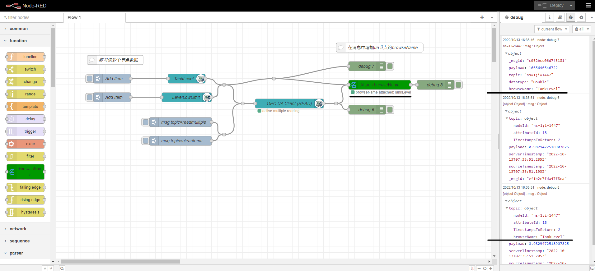

# node-red-contrib-node-browseName

A simple node that attaches browseName to msg.topic for opc-ua node when it doesn't exist.## 

## Description

当opc ua client 读取多个节点时,首先向ua 客户端增加节点，这时消息的topic中包含节点的browseName。如：

```json
{"_msgid":"647ce35a9062c3a7","payload":1665641675806,"topic":"ns=1;i=1456","datatype":"Double","browseName":"LevelLowLimit"}
```

但ua client 读取多个节点的结果中，不再包含`browseName`而仅仅包含ua node的id。如：

```json
{"topic":{"nodeId":"ns=1;i=1456","attributeId":13,"TimestampsToReturn":2},"payload":0.2,"serverTimestamp":"2022-10-13T06:14:50.018Z","sourceTimestamp":"2022-09-15T08:47:46.760Z","_msgid":"7033fb78538da981"}
```

这样，在进一步导出数据或者处理时，难以区分数值的含义，通过本attach-browseName节点，可以为消息添加browseName，如:

```json
{"topic":{"nodeId":"ns=1;i=1447","attributeId":13,"TimestampsToReturn":2,"browseName":"TankLevel"},"payload":0.916998697044078,"serverTimestamp":"2022-10-13T06:14:50.018Z","sourceTimestamp":"2022-10-13T06:14:49.887Z","_msgid":"e6e6c160537c8c97"}```
```

## Installation

Install from github

> npm install git+https://github.com/yinjilong/node-red-contrib-node-browseName.git

```bash
npm install git+https://github.com/yinjilong/node-red-contrib-node-browseName.git
```

### Example




==END==
